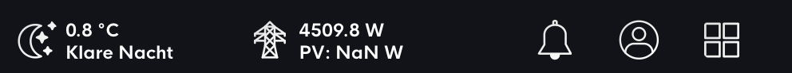

# Fast Navigation Card

A custom card for Home Assistant that provides a flexible navigation bar that can be positioned at the top, bottom or as a sidebar.



## Important Note
This card is specifically designed for dashboards that have a maximum width of one section. It will not align correctly with dashboards that use multiple sections in their layout.

## Features

- Three positioning options: top, bottom, and sidebar
- Responsive design
- Automatic alignment with main content
- Supports grid layout for navigation buttons
- Perfect for single-section dashboard layouts


## Installation

### HACS (Custom Repository)
1. In HACS, click on "Frontend" section
2. Click the menu icon in the upper right and select "Custom repositories"
3. Add this repository URL: [https://github.com/fastender/Fast-Navigation-Card]
4. Select "Lovelace" or "Dashboard" as category
5. Click "Install"


### Manual Installation
1. Download `fast-navigation-card.js`
2. Copy it to your `www` folder
3. Add it as a resource in your Lovelace configuration:
```yaml
resources:
  - url: /local/fast-navigation-card.js
    type: module
```

## Usage

```yaml
type: custom:fast-navigation-card
position: top  # Options: 'top', 'bottom', 'sidebar'
card:
  type: grid
  square: false
  columns: 5
  cards:
    - type: custom:button-card
      # ... your button configuration
```

## Options

| Name | Type | Default | Description |
|------|------|---------|-------------|
| position | string | 'top' | Position of the navigation bar. Options: 'top', 'bottom', 'sidebar' |
